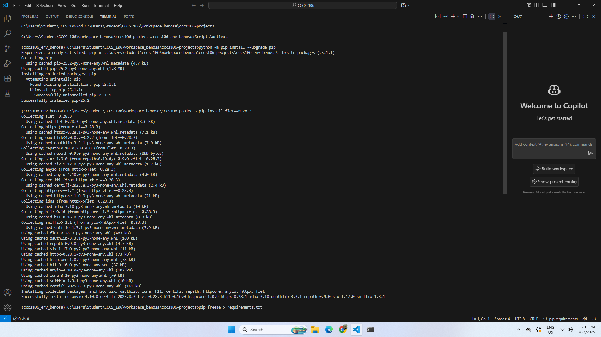
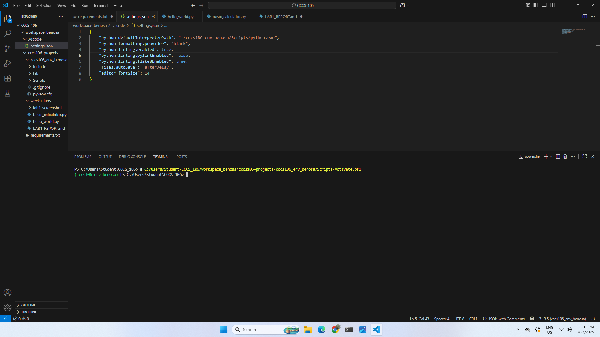
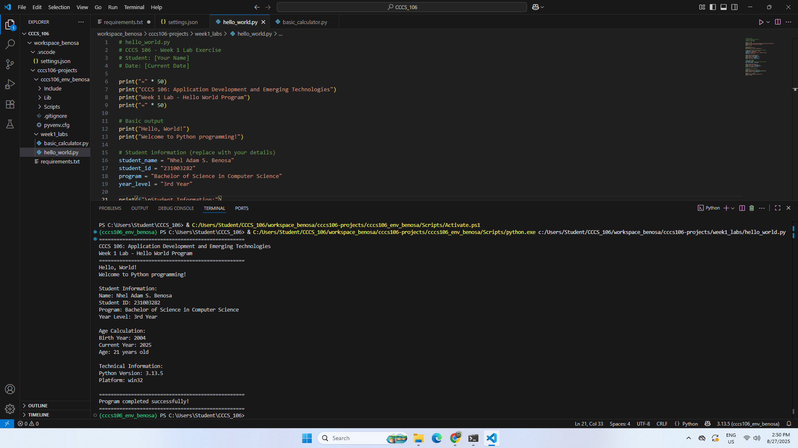
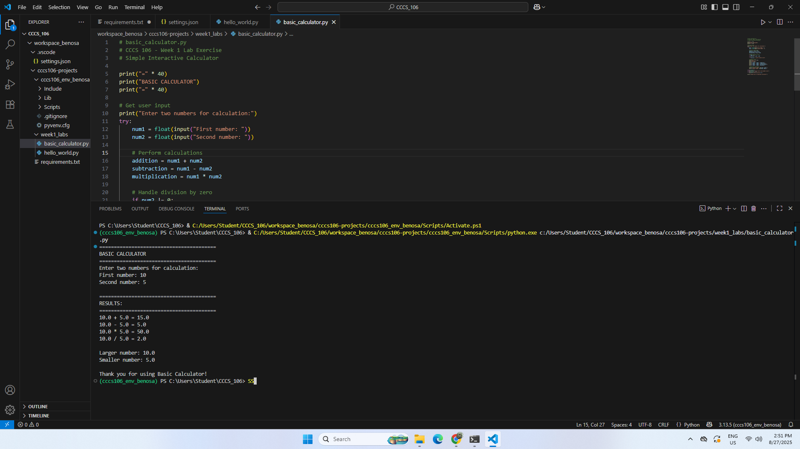

# Lab 1 Report: Environment Setup and Python Basics

**Student Name:** Nhel Adam S. Benosa
**Student ID:** 231003282
**Section:** BSCS-3B
**Date:** 08-27-2025

## Environment Setup

### Python Installation
- **Python Version:** 3.13.5
- **Installation Issues:** None, because python is already installed
- **Virtual Environment Created:** ✅ cccs106_env_lastname

### VS Code Configuration
- **VS Code Version:** 3.13.5
- **Python Extension:** ✅ Installed and configured
- **Interpreter:** ✅ Set to cccs106_env_benosa/Scripts/python.exe

### Package Installation
- **Flet Version:** 0.28.3
- **Other Packages:** List any additional packages

## Programs Created

### 1. hello_world.py
- **Status:** ✅ Completed
- **Features:** Student info display, age calculation, system info
- **Notes:** None

### 2. basic_calculator.py
- **Status:** ✅ Completed
- **Features:** Basic arithmetic, error handling, min/max calculation
- **Notes:** None

## Challenges and Solutions

cant activate the environment in vs code and realized that it's running in powershell, so I switch to comand prompt then it works

## Learning Outcomes

Today I learn how to setup a vitual environment and also install flet framework which we'll be using all through out the semester

## Screenshots

